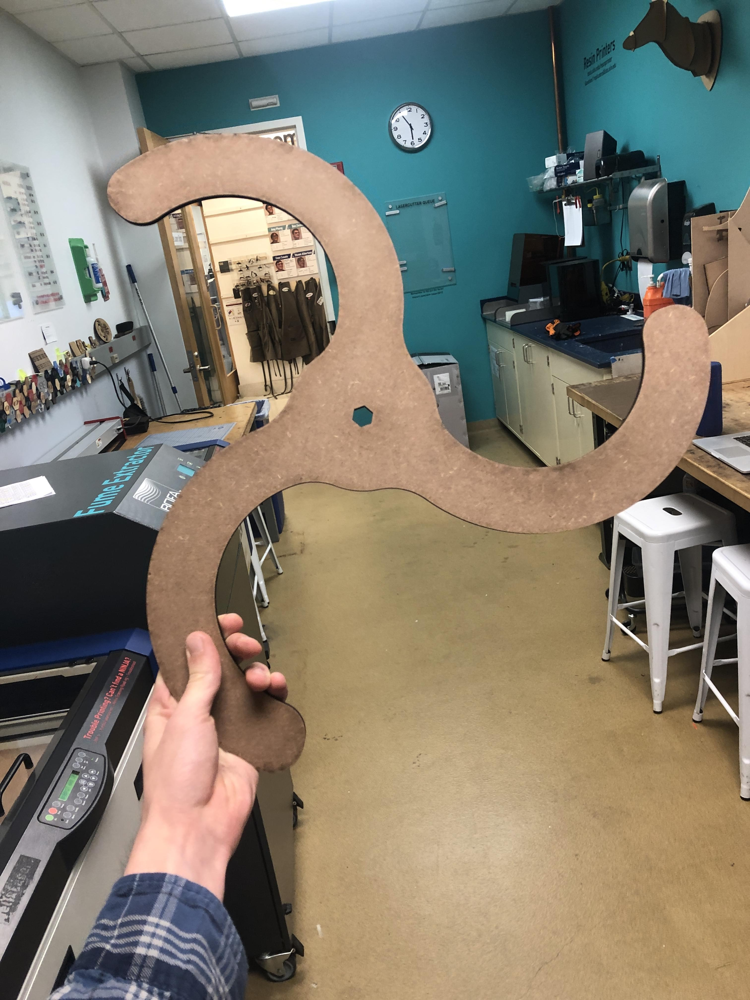
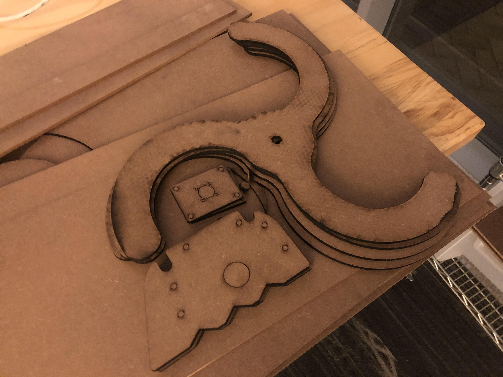
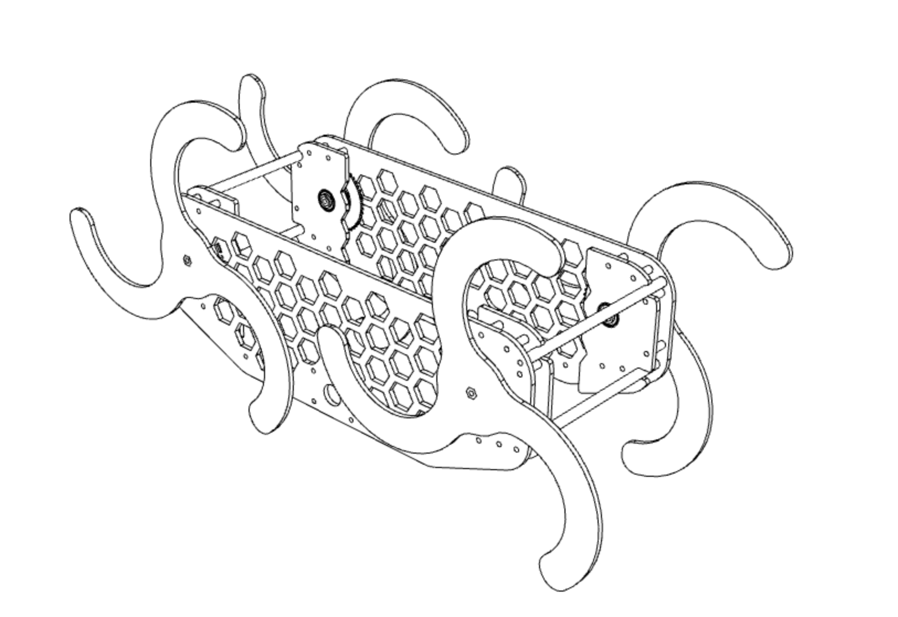

We cut new whegs today, in an effort smooth out the jagged movement of the original wheg design. 

Laser cut MDF pieces for the new whegs of the robot and of standoffs to offer axle stability.

We cut out a number of new parts today! They include four new whegs based on the new design. We hope that they will stabilize the movement of the robot as it goes from step to step. We also cut out four standoffs to stabilize the axles of the whegs which will have locked and press-fit bearings in them. 

Through a small amount of trial and error, we've got the kerf and error on the press fit features of our chassis down, and we've successfully fit bearings into laser cut MDF parts snugly. Of course, we won't be relying exclusively on that, we also have a stack of spacers and locking washers on the axle to keep the assembly "sandwich" tight and together. After a lot of experimentation and some mis cuts a few days ago, we also finally nailed the settings for cutting MDF quickly and effectively.  

Final part of this update, I promise!

We've been remodeling the cad file, and it is now much more modular and easy to iterate on. Here's a peak in my desired rendering style :)

-Dieter