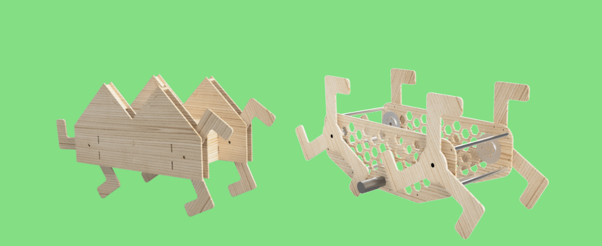
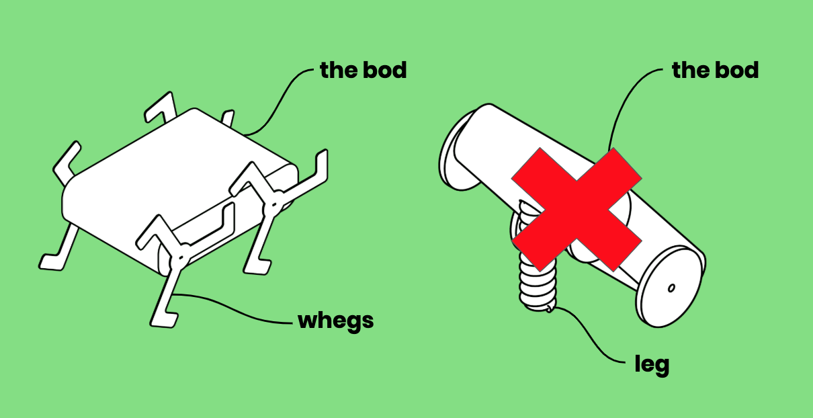

This past spring, I've been working a lot on the chassis design. The sizing, strength, weight, and mountpoint considerations for a chassis like this are crucial. First, at the beginning of this spring, we selected a wheg-based design rather than an extending-leg design:

*We chose whegs over an extending leg because whegs were consistently more reliable in all of our testing and research.*

Whegs (*wheel legs*) limit movement speed because they introduce wobble and vibration on flat ground, but we decided that was worth it because our robot only needs to traverse brief sections of Olin's dorms on flat ground. We would prefer a robot that can reliably climb stairs than a robot that can go as fast as possible and stumble up/down stairs.

*We moved to a new, lighter chassis design that uses aluminum rods for strength instead of self-reinforcing MDF panels.*

Our initial chassis, pictured on left, was designed to literally look like a home walking around the dorms. It was held together with interlocking, glued panels. We decided to move to the design on the right, which has an open chassis, to reduce the weight and assembly complexity of our robot.

-Sam