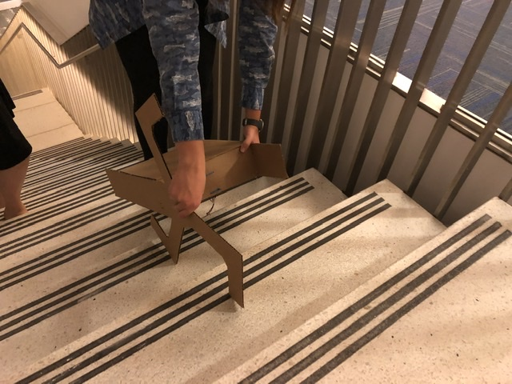
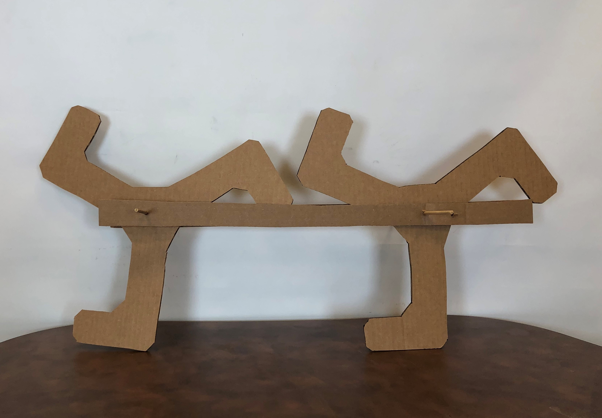

Working with the geometry of a rather complicated leg motion was incredibly valuable as a tool to understand how the robot will act while climbing stairs. At first, I thought this would only help with that but I quickly realized there is a lot more to learn from a sketch model like this. Using the second image, we were able to vary the distance between the legs and use our hands to twist the axels and roughly mimic the motion. By doing this, we were able to observe how the system acted on the stairs, but we also learned a lot just by feeling out the forces at different points in the motion. We learned that you need a lot of torque to get the legs up from when they are on a single point to elevating to the next stair; so much torque that we thought there was another issue other than the force necessary. This realization is super valuable for moving forward because this is a very bare system with almost no weight and still a lot of torque was required. It showed a weak point in the design with a pretty low effort input. Additionally, working through this allowed us to create a cardboard chassis that we can use for multiple different sketch models.

-David