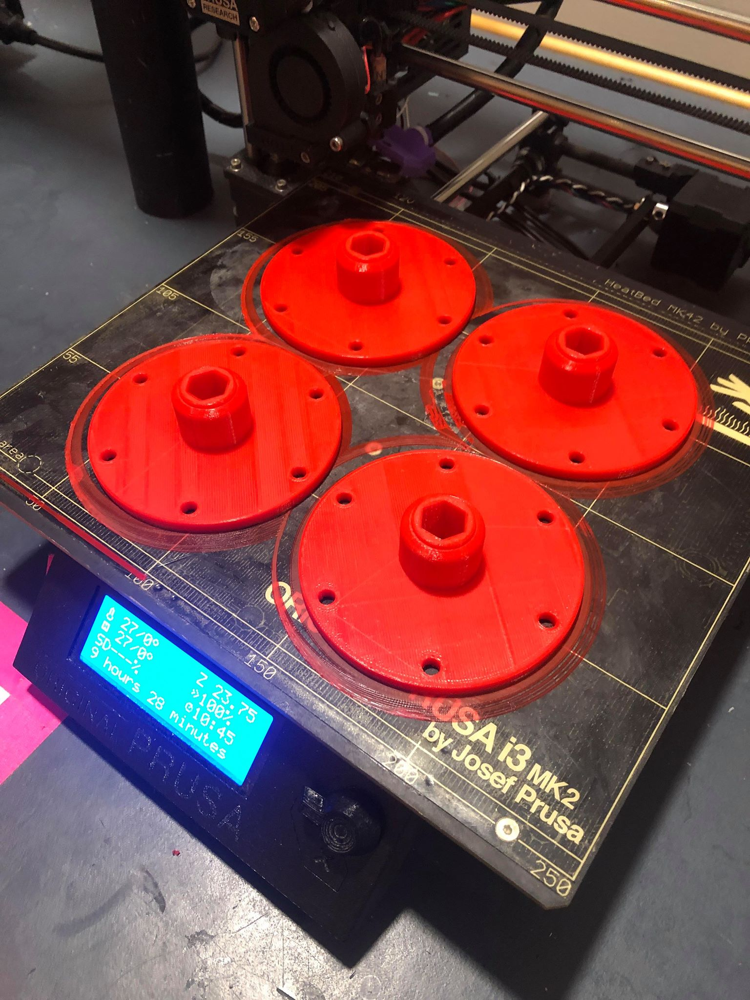
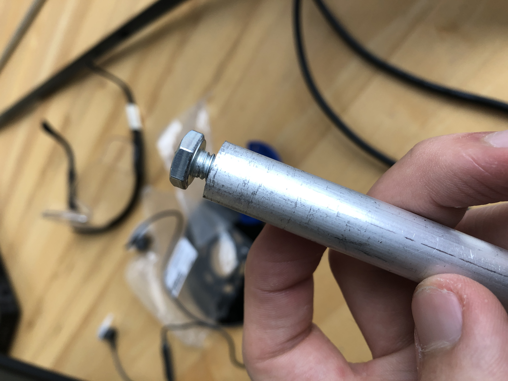
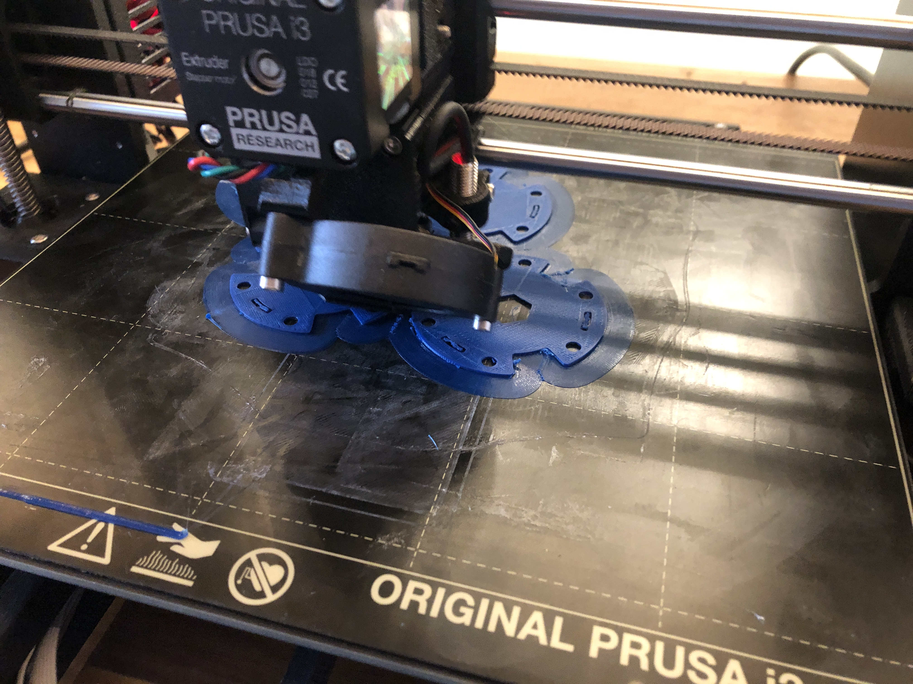
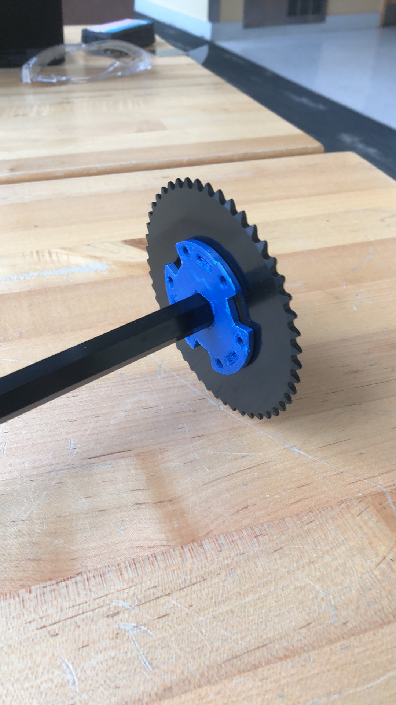
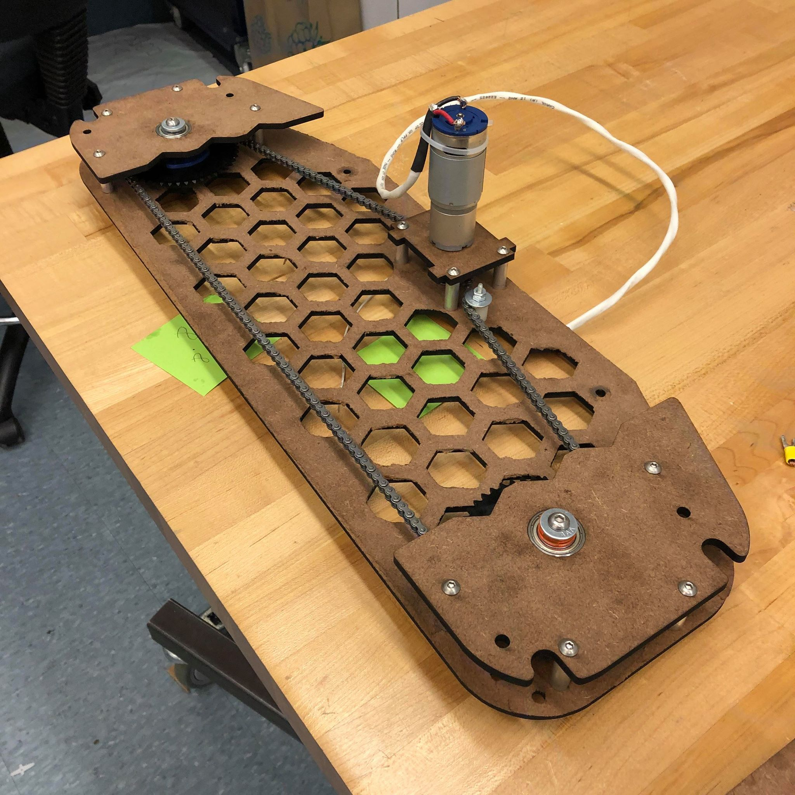
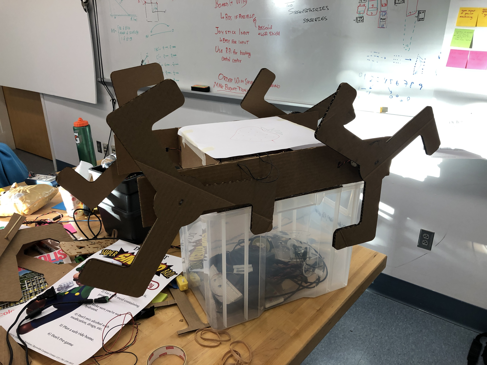
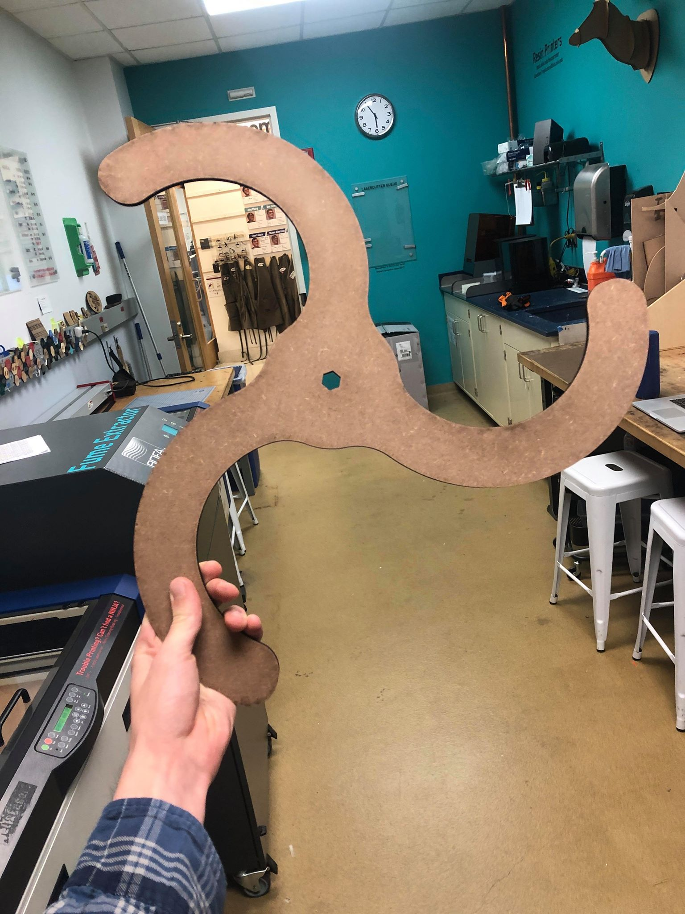
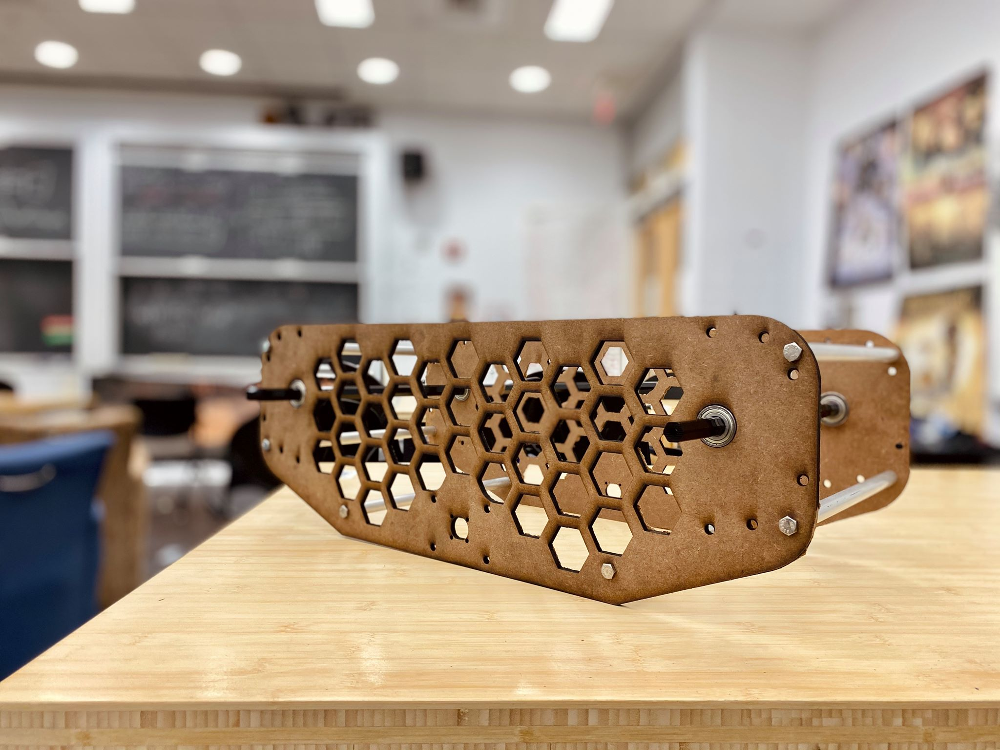

# Requirements
* Drive up stairs
* Drive on flat ground
* Drive down stairs
* Balance a load

# General Description
The mechanical system is comprised of our drive train, chassis, and actuated gimbal.

# Process and Components
## Drivetrain
Our drive train was designed as a tank drive so that we could turn while keeping the whegs on each side of the drive train in sync to keep them from colliding with each other. Our MDF whegs are attached to aluminum hex shaft by a 3D printed part.

The part bolts onto the whegs and press fits onto the hex shaft. We also tapped the hex shaft on both ends in order to screw the 3D printed part to the shaft.

The sprockets are held in place between the chassis and another board by laser cut acrylic spacers. They're attached to the hex shaft by a 3D printed hub that bolts onto the sprocket and press fits onto the hex shaft.

We used two chain tensioners near each motor in order to increase wrap around the motor and prevent the chain slipping on the motor sprocket. After assembly, we were able to take off a chain tensioner to adjust the alignment of the whegs so that they were synchronized on each side.

## Whegs
We started out designing the whegs for our robot by using cardboard to test the size of the whegs and the spacing between them.

From there we moved on to integrating the whegs into a CAD model so that we could laser cut the whegs. We laser cut two different wheg shapes out of cardboard to test how smooth the robot would climb the stairs with the two different wheg shapes. We decided to use the curvier leg shape to laser cut out of MDF because they would jolt the robot less as we climbed stairs and traversed even ground.

To connect the whegs to the chain-driven system, have the CAD design of the axel assembly to connect hubs, sprockets, and correct spacing for wheg drive as shown below.

## Chassis
The chassis is comprised of two MDF boards with a fun hexagon pattern cutout to make easy attachment points for zip ties, give easier access to parts, and lighten our robot. The two MDF boards are held together by standoffs we manufactured by cutting, drilling, and tapping aluminum rod. We used the same manufacturing process for all the other plates and standoffs in our robot to attach the gimble, motors, and electronics.

