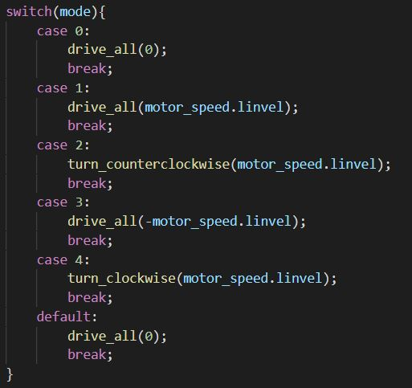

# Software Requirements
* Drive the robot with adjustable speed (C++) 
* Manage keyboard inputs to execute motion commands (Python)
* Manually balance wheg phase (C++)
* Process accelerometer and gyroscope inputs to calculate current angle of the robot and control the servo to counterbalance the robot angle and remain level to the ground (C++) 

# General Description
## Python
Once the user has connected to the Raspberry Pi, which has our code repository already flashed into the device, we run a Python script which handles the keyboard input using threading and termios, a Linux terminal I/O module that enables us to read command line inputs. This enables us to continuously check for inputs and add them to a thread which we can parse and use. We first get a key, then parse the input to see if it matches with any of the keys mapped to commands such as drive forward, backwards, or increase/decrease speed. From there, we have a serial connection from the Raspberry Pi this code is running on and the Arduino. We write the key command to the serial monitor and the C++ code on the Arduino handles the input to drive the robot based on these inputs. 
## C++
With keyboard inputs coming in via Serial, we create a system of modes that will be run based on the keyboard input. This functionality is shown below:

By switching between between these modes, we can seamlessly perform multiple motion tasks and switch between them. While we are doing this every single loop, we are also checking the accelerometer and gyroscope data. We configured the gyroscope and accelerometer to have the lowest range of motion to detect, but it will detect it with the highest accuracy. We found that our robot wasn't ever reaching accelerations greater than +/- 2g so we could have a much more precise measurement. We then use the gyroscope which we configured for slight error to read the bytes containing the angle in the axis we are balancing in. We convert the units to degrees and write the opposite of that value to the servo to balance. By doing both of these tasks every loop and controlling through the Python side, we can have a solid wireless control that accomplishes all of our requirements. 

# Controls
For simplicity, we used a WASD style interface to drive the robot where <kbd>"T"</kbd> drives forward, <kbd>"G"</kbd> drives backwards, <kbd>"F"</kbd> drives left and <kbd>"H"</kbd> drives right for phase alignment. Furthermore, for code safety, we have a start and stop command which are <kbd>"S"</kbd> and <kbd>"E"</kbd>, respectively. To increase the speed of the robot, you can input <kbd>"."</kbd>, which increases the speed by 10%. Alternatively, <kbd>","</kbd> will decrease the speed by 10%. Speed control is done by a percentage of the maximum linear velocity. 

# Moving Forward
We didn't get into autonomous motion, but we theorize that a lot of the tasks like manual phase sync could become autonomous using the accelerometer and a PID loop to always tune the whegs into sync. Furthermore, we could work more with turning to get that aspect of the robot functional. Lastly, we could do a better job with sensing to make sure that the robot is always on the stair and not hitting the wall next to the stairs. Eventually we could implement path planning, but that is WAY down the road from the point we are at now. 